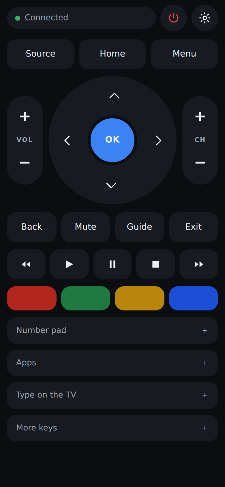
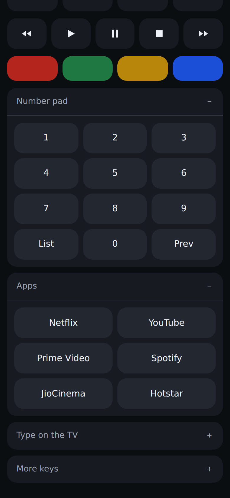

# Samsung TV web remote

A virtual remote for a Samsung smart TV that runs in a phone browser. No app
store, no subscription, no dependencies — one `node server.js` on a machine at
home, and the remote is a web page on your phone.

Built and tested against the protocol a **UA40N5200 (2019, N series)** speaks,
which is the same channel every Tizen set from 2016 onward uses.

<!-- Screenshots live in docs/ so the README renders on GitHub. -->
<p align="center">
  
  
</p>

## Why this needs a small server

The obvious version of this — a single HTML file you open on your phone — can't
work. The TV only accepts remote-control commands over an encrypted WebSocket on
port 8002, and it presents a **self-signed certificate**. Every phone browser
refuses that connection outright, and there is no prompt to click through for a
WebSocket. On top of that, the TV hands out a pairing token on first connection
that has to be stored somewhere and sent on every later connection.

So the page stays dumb and something on your network does the talking:

```
phone browser  --HTTP-->  this server  --wss + token-->  TV
```

Anything that runs Node works as that middle box: a laptop, a Raspberry Pi, a
NAS, an always-on desktop. It has to be on the same network as the TV.

## Setup

You need Node 20 or newer, and the TV switched on for the first pairing.

```bash
cd samsung-remote
npm start
```

It prints the addresses to open:

```
Samsung TV remote is running.
Open one of these on your phone (same Wi-Fi):
  http://192.168.1.10:8099
```

On your phone, on the same Wi-Fi, open that address. Then:

1. Tap the **gear**, then **Find my TV**. It sweeps the network and lists any
   Samsung set it finds, with the model number so you can tell which is yours.
   (If nothing turns up, type the address by hand — the TV shows it under
   *Settings › General › Network › Network Status*.)
2. Tap your TV in the list, then **Save**.
3. Tap **Pair with the TV**. A prompt appears **on the TV screen** — choose
   **Allow** with the physical remote, or with the TV's own buttons if that is
   the whole problem. This is the one moment you need another way to press OK.
4. The token is saved to `data/config.json`. You never pair again.

Then **Add to Home Screen** from the browser menu. It gets an icon and opens
full-screen with no browser chrome, which is as close to an app as this needs
to be.

### If you can't press Allow on the TV at all

The pairing prompt is the one step that needs a working remote. If the remote is
completely dead:

- The **SmartThings** app (free, Samsung's own) can pair over the network and
  will let you press Allow once.
- Most Samsung sets have a physical joystick or button under the front-right
  corner of the bezel, or on the back — one press acts as OK.
- A cheap universal IR remote also gets you through that single prompt.

Once paired, none of that is needed again.

## Turning the TV on

A TV that is fully off is not on the network, so no command can reach it. The
power button falls back to a **wake-on-LAN** packet, which needs the TV's MAC
address — discovery fills that in for you.

This works reliably over **Ethernet**. Over Wi-Fi it depends on the set keeping
its radio alive in standby, which the N series often does not. If waking does
not work, check *Settings › General › Network › Expert Settings* and turn on
**Power On with Mobile** (some firmware calls it *Network Standby*). If it still
does not wake over Wi-Fi, a cable to the TV fixes it.

Turning **off** always works, since the TV is awake when you ask.

## Keeping it running

`npm start` in a terminal is fine while you try it. For something permanent, on
a Linux box or a Pi:

```ini
# /etc/systemd/system/tv-remote.service
[Unit]
Description=Samsung TV web remote
After=network-online.target

[Service]
ExecStart=/usr/bin/node /home/you/samsung-remote/server.js
WorkingDirectory=/home/you/samsung-remote
Restart=always
User=you

[Install]
WantedBy=multi-user.target
```

```bash
sudo systemctl enable --now tv-remote
```

Give the TV a **DHCP reservation** in your router while you are there, so its
address does not change and strand the setup.

## Troubleshooting

| What you see | What it means |
| --- | --- |
| "TV is off — tap power" | Nothing is answering on port 8001. The set is off, asleep, or on another network. |
| "Allow this device on the TV" that never clears | The prompt is up on the TV and nobody pressed Allow. It times out after 30 seconds. |
| "The TV refused this device" | This device was denied before. On the TV: *Settings › General › External Device Manager › Device Connection Manager › Device List*, delete this entry, then pair again. |
| Pairs, but keys do nothing | Some sets need *Device Connection Manager › Access Notification* set to *First Time Only* rather than *Off*. |
| Discovery finds nothing | The phone and the server must be on the same subnet as the TV. Guest Wi-Fi networks are usually isolated from the main one and will not work. |

**Older sets (2016–2017).** Those use an unencrypted channel on port 8001 with
no token. If port 8002 never connects, stop the server and edit
`data/config.json`:

```json
{ "host": "192.168.1.42", "port": 8001, "secure": false, "token": null }
```

## A note on who can use it

The server has no password. Anyone on your Wi-Fi who finds the port can change
the channel — treat it like the physical remote, which anyone in the room can
also pick up. It does refuse requests from other websites your phone has open,
so a page in another tab cannot quietly drive your TV.

Don't forward the port through your router. Nothing here is built for the open
internet.

## How it fits together

```
server.js            HTTP: serves the page, exposes the JSON API
lib/ws.js            a minimal RFC 6455 WebSocket client (the TV's cert is
                     self-signed, so this needs to skip verification)
lib/tv.js            the Samsung channel protocol: pairing, keys, text, apps
lib/discover.js      SSDP shout plus a subnet sweep for port 8001
lib/wol.js           wake-on-LAN magic packets
lib/keys.js          the key codes the TV accepts
lib/config.js        where the address and pairing token are kept
public/              the remote itself
```

There are no runtime dependencies, so there is nothing to install and nothing to
keep updated.

## Tests

```bash
npm test
```

65 tests, no hardware needed. `test/fake-tv.js` is a stand-in television: it
performs the WebSocket server handshake, speaks the Samsung channel protocol,
and records what it was told to do. Its framing is written independently of the
client's, so the two check each other. The suite covers the protocol end to end
— pairing, token reuse, reconnection after a drop, a refused pairing, and a
real self-signed TLS handshake — along with the HTTP API, discovery, wake-on-LAN
packets, and the config file.

Icons are generated rather than checked in as opaque binaries: `npm run icons`.
